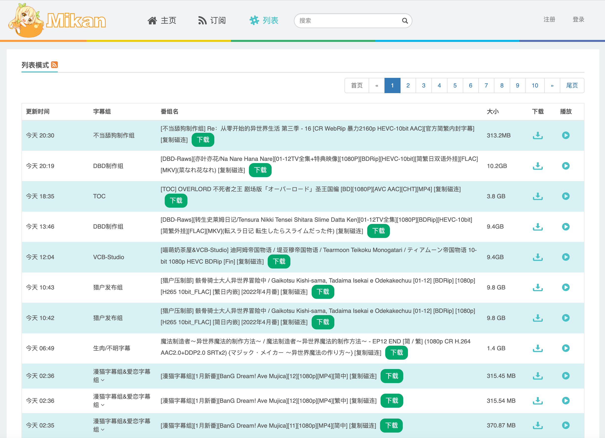

# qBit Linker

## 简介

这是一个Tampermonkey（油猴）的脚本，用于给一些提供磁力（种子）链接网站增加一个按钮一键添加到qBittorrent中

> [!WARNING]
> 在使用前你应该查看适用网站和使用教程

## 截图

## 适用网站

- 蜜柑计划 (mikanime.tv & mikanani.me)
- ACG.RIP (acgrip.art)w
- nyaa (nyaa.si)
- 动漫花园 (dmhy.org)
- 萌番组 (bangumi.moe)

## 使用教程

1. 你需要在你的浏览器上安装Tampermonkey扩展
2. 点击扩展图标，选择添加新脚本
3. **修改`main.js`代码37~39行中qBittorrent的配置"**
4. 复制`main.js`代码到代码区域，然后点击文件-保存即可